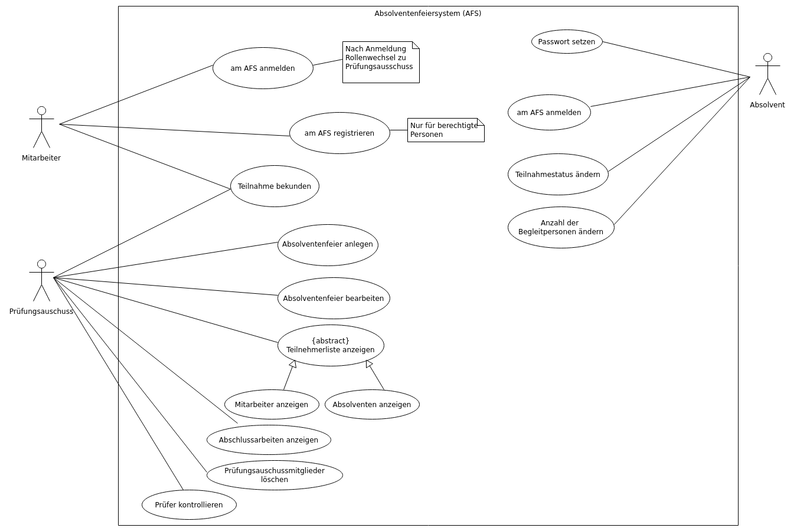

---
author:
   name1: {Hartings, Robert, 1164453}
   name2: {Niersmann, Alexander, 1164424}
title:
   main: Software Engineering WS 2019/2020
   sub1: Praktikum Gruppe D
   sub2: Dokumentation Aufgabe 1
revision:
   doc: hartings_niersmann.p1.000.md
   level: 0
   date: 11.11.2019
lang: de
cssextra: vorlage.css
---

# TEIL I: Voruntersuchung {.unnumbered .clDocPartHeader}

# Schätzung des Aufwands

## Zusammenstellung und Klassifizierung der Elementarprozesse

### Ausgaben

Prüfungsausschuss:
* Teilnehmerliste der Absolventen
* Teilnehmerliste der Mitarbeiter
* Auflistung der Abschlussarbeiten
* Prüfer des Studenten

Alle: 
* Informationen der Absolventenfeier 

### Eingaben

Absolventen:
* Passwort setzen
* Teilnahmestatus ändern 
* Anzahl der Begleitpersonen ändern

Mitarbeiter:
* Teilnahme bekunden

Prüfungsausschuss:
* Registrierung am ASF
* Absolventenfeier anlegen
* Absolventenfeier bearbeiten

## Daten

### Interne Datenbestände

* Weitere Absolventen-Informationen
* Teilnehmer Mitarbeiter
* Informationen Abschlussfeier
* Zugangsdaten Prüfungsausschuss

### Referenzdaten

* Absolventenliste vom Prüfungsamt

Diese Daten beinhalten den Namen, den Vornamen, 
die E-Mail sowie Informationen zur Abschlussarbeit (Titel, Art und Prüfer).

### Data Dictionary

```
feier ::= name + #datum + uhrzeit + ort;

absolventen_ex ::= name + vorname + #email + arbeitstitel + arbeitstyp + pruefer1 + pruefer2;

absolventen_in ::= @absolvent_ex + passwort + teilnahmestatus + anzahlBegleitperson;

mitarbeiter ::= name + vorname + #email;

zugangsdaten ::= name + vorname + #email + passwort;

name ::= string;  
datum ::= date;  
uhrzeit ::= time;  
ort ::= string;  

vorname ::= string;  
email ::= string;  
arbeitstitel  ::= string;  
arbeitstyp ::= [' Bachelor '|' Master '];  
pruefer1 ::= string;  * Professor *   
pruefer2 ::= string;  * FB Mitarbeiter und != Pruefer1 *  

passwort ::= string; * leer bei unregistrierte Absolventen *  
teilnehmerstatus ::= boolean; * Standard ist false *  
anzahlBegleitperson ::= number;  
```


## Komplexität / Berechnung der unbewerteten FP

+-----------------------+--------+----------------+------------+------+
| Kategorie             | Anzahl | Klassifzierung | Gewichtung | Wert |
+=======================+========+================+============+======+
| Eingaben              |   7    | einfach        |     3      |  21  |
+-----------------------+--------+----------------+------------+------+
| Eingaben              |   0    | mittel         |     4      |   0  |
+-----------------------+--------+----------------+------------+------+
| Eingaben              |   0    | komplex        |     6      |   0  |
+-----------------------+--------+----------------+------------+------+
| Ausgaben              |   4    | einfach        |     4      |  16  |
+-----------------------+--------+----------------+------------+------+
| Ausgaben              |   1    | mittel         |     5      |   5  |
+-----------------------+--------+----------------+------------+------+
| Ausgaben              |   0    | komplex        |     7      |   0  |
+-----------------------+--------+----------------+------------+------+
| Abfragen              |   0    | einfach        |     3      |   0  |
+-----------------------+--------+----------------+------------+------+
| Abfragen              |   0    | mittel         |     4      |   0  |
+-----------------------+--------+----------------+------------+------+
| Abfragen              |   0    | komplex        |     6      |   0  |
+-----------------------+--------+----------------+------------+------+
| Interne Datenbestände |   4    | einfach        |     7      |  28  |
+-----------------------+--------+----------------+------------+------+
| Interne Datenbestände |   0    | mittel         |    10      |   0  |
+-----------------------+--------+----------------+------------+------+
| Interne Datenbestände |   0    | komplex        |    15      |   0  |
+-----------------------+--------+----------------+------------+------+
| Referenzdaten         |   1    | einfach        |     5      |   5  |
+-----------------------+--------+----------------+------------+------+
| Referenzdaten         |   0    | mittel         |     7      |   0  |
+-----------------------+--------+----------------+------------+------+
| Referenzdaten         |   0    | komplex        |    10      |   0  |
+-----------------------+--------+----------------+------------+------+
| Summe                 |  16    |                |            |  75  |
+-----------------------+--------+----------------+------------+------+

Ausgabe mittel: `Teilnehmerlist der Absolventen`, da dort auf zwei Datenbestände zugegriffen wird 
und die Summe der Datenfelder zwischen 5 und 15 liegt.

## Berechnung der bewerteten FP

### Einflußfaktor (VAF/Value adjustment factor)

#### Systemmerkmale

14 allgemeine Systemmerkmale, mit denen die allgemeine Funktionalität einer Anwendung klassifiziert wird:

+--------------------------------+-----------------------------+
| Systemmerkmal                  |   Gewichtung                |
+================================+=============================+
+--------------------------------+-----------------------------+
| 1.  Datenkommunikation         |                 5           |
+--------------------------------+-----------------------------+
| 2.  Verteilte Verarbeitung     |                 0           |
+--------------------------------+-----------------------------+
| 3.  Leistungsfähigkeit         |                 1           |
+--------------------------------+-----------------------------+
| 4.  Begrenzte Kapazität        |                 1           |
+--------------------------------+-----------------------------+
| 5.  Transaktionsrate           |                 4           |
+--------------------------------+-----------------------------+
| 6.  Interaktive Dateneingabe   |                 4           |
+--------------------------------+-----------------------------+
| 7.  Benutzerfreundlichkeit     |                 3           |
+--------------------------------+-----------------------------+
| 8.  Interaktive Änderung       |                 3           |
+--------------------------------+-----------------------------+
| 9.  Komplexe Verarbeitung      |                 1           |
+--------------------------------+-----------------------------+
| 10.  Wiederverwendbarkeit      |                 0           |
+--------------------------------+-----------------------------+
| 11.  Installationshilfen       |                 0           |
+--------------------------------+-----------------------------+
| 12.  Betriebshilfen            |                 0           |
+--------------------------------+-----------------------------+
| 13.  Mehrfachinstallation      |                 0           |
+--------------------------------+-----------------------------+
| 14.  Änderungsfreundlichkeit   |                 0           |
+--------------------------------+-----------------------------+

#### Einflussgrade (DI/Degree of influence)

Formel zur Berechnung des Einflussgrades:
```
Skala von 0 (kein Einfluss) bis 5 (starker Einfluss)
Gesamteinflussgrad (TDI, engl. Total degree of influence): Summe der 14 Werte
VAF berechnet sich dann anhand folgender Formel: VAF = (TDI * 0.01) + 0.65

AFP (Adjusted FP Count) = VAF * UFP (Unadjusted FP)
```

Resultat:
```
TDI = 5 + 1 + 1 + 4 + 4 + 3 + 3 + 1 = 22
VAF = (22 * 0.01) + 0.65 = 0.87
AFP = 0.87 * 75 = 65.25
```

## Ermittlung Personalaufwand, Bearbeitungsdauer, Kosten

Formel zur Ermittlung des Personalaufwandes:
```
Zur Abschätzung des Entwicklungsaufwands in Personenmonaten gibt es in der Literatur u. a. folgende Formel:
Aufwand (Personenmonate) = FP^1.4^ / 150
```

Aufwand in Personenmonate = `65.25^(1.4) / 150 = 2.166 ~ 3`

Formel zur Berechnung der Kosten:
```
Projektkosten = Personenmonate * Gehalt * 2
```

Die Projektkosten belaufen sich auf `3 * 45000€ * 2 = 27000 €`

Das Projekt sollte von zwei Personen in 1.5 Monaten durchgeführt werden.

# TEIL II: Anforderungsanalyse {.unnumbered .clDocPartHeader}

# Zielbestimmung

Der Prüfungsausschuss soll mithilfe der beschriebenen Anwendung die Absolventenfeier verwalten können.
Die Mitglieder des Prüfungsausschuss können die Informationen der Abschlussfeier (ein-)pflegen
sowie eine aktuelle Teilnehmerliste abrufen
Mitarbeitern des Fachbereichs und Absolventen können sich über die hier beschriebene Anwendung
zur Absolventenfeier anmelden.

# Produkt-Einsatz    

## Anwendungsbereiche

Die beschriebene Software Lösung soll im Universitätsumfeld genutzt werden,
um eine Verwaltung von Absolventenfeiern zu ermöglichen.

## Zielgruppen

Die beschriebene Anwendung richtet sich an drei Zielgruppen.

#### 1. Absolventen

Die Absolventen geben an, ob und mit wie vielen Begleitpersonen diese an der Absolventenfeier teilnehmen möchten.

#### 2. Mitarbeiter des Fachbereichs

Zu den Mitarbeitern des Fachbereichs zählen neben den Professoren auch alle anderen Angestellten,
welche am Fachbereich tätig sind. Diese können sich mithilfe der Anwendung auch an der Absolventenfeier anmelden.

#### 3. Mitglieder des Prüfungsausschuss

Die gewählten Mitglieder des Prüfungsausschusses stehen dieselben Funktionen zur Verfügung,
wie den Mitarbeitern des Fachbereichs. Ihr Handlungsspielraum wird ergänzt durch die Möglichkeiten
der Organisation der Absolventenfeier sowie einer Ausgabe von angemeldeten Gästen
und eine Aufstellung der Bachelorarbeiten.

## Betriebsbedingungen

Die Anwendung soll (nur) im Intranet der Hochschule Niederrhein genutzt werden.
Damit die Anwendung ordnungsgemäß arbeiten kann, benötigt die beschriebene Anwendung die externen Daten
des Prüfungsamtes.

Diese Daten müssen den Namen, den Vorname, die E-Mail-Adresse, den Titel der Arbeit,
den Typ der Abschlussarbeit sowie den Erst- und Zweitprüfer enthalten. 

# Produkt-Umgebung

Die Anwendung benötigt eine Schnittstelle zu dem Datenbestand des Prüfungsamtes,
um so den externen Dantenbestand zu erhalten.

## Software

Es wird ein Webserver benötigt sowie eine NoSQL-Datenbank-Software.

## Hardware

Zum Betreiben der Anwendung wird keine spezielle Hardware benötigt.

Da eine Verbindung zum Intranet der Hochschule benötigt wird und die Anwendung auf externe Daten zugreift,
wird ein Netzwerk-Adapter benötigt.

# Funktionale Produkt-Anforderungen

## Anwendungsfälle




:(Teilnahme Bekunden) 

+----------------------+-----------------------------------------------------------------------------+
|     Bezeichnung      |                                                                             |
+======================+=============================================================================+
| Ziel                 | Mitarbeiter ist zur Absolventenfeier angemeldet                             |
+----------------------+-----------------------------------------------------------------------------+
| Akteure              | Mitarbeiter, Prüfungsausschuss                                              |
+----------------------+-----------------------------------------------------------------------------+
| Auslösendes Ereignis | Mitarbeiter möchten an der Feier teilnehmen                                 |
+----------------------+-----------------------------------------------------------------------------+
| Vorbedingung         | Absolventenfeier angelegt                                                   |
+----------------------+-----------------------------------------------------------------------------+
| Nachbedingung        | Mitarbeiter/Prüfungsausschuss zur Absolventenfeier angemeldet               |
+----------------------+-----------------------------------------------------------------------------+
| Kategorie            | primär                                                                      |
+----------------------+-----------------------------------------------------------------------------+
| Beschreibung         | Mitarbeiter und Prüfungsausschuss bekunden ihre Teilnahme an der            |
|                      | Absolventenfeier                                                            |
+----------------------+-----------------------------------------------------------------------------+


:(am AFS registrieren) 

+----------------------+-----------------------------------------------------------------------------+
|     Bezeichnung      |                                                                             |
+======================+=============================================================================+
| Ziel                 | Prüfungsausschuss meldet sich zum Backend des AFS an                        |
+----------------------+-----------------------------------------------------------------------------+
| Akteure              | Mitarbeiter                                                                 |
+----------------------+-----------------------------------------------------------------------------+
| Auslösendes Ereignis | Prüfungsausschuss möchte das Backend benutzen können                        |
+----------------------+-----------------------------------------------------------------------------+
| Vorbedingung         |                                                                             |
+----------------------+-----------------------------------------------------------------------------+
| Nachbedingung        | Neues Prüfungsausschussmitglied ist im AFS registriert                      |
+----------------------+-----------------------------------------------------------------------------+
| Kategorie            | sekundär                                                                    |
+----------------------+-----------------------------------------------------------------------------+
| Beschreibung         | Ein Mitarbeiter (Mitglied des Prüfungsausschuss) registriert sich, um das   |
|                      | Backend des AFS nutzen zu können                                            |
+----------------------+-----------------------------------------------------------------------------+


:(am AFS anmelden) 

+----------------------+-----------------------------------------------------------------------------+
|     Bezeichnung      |                                                                             |
+======================+=============================================================================+
| Ziel                 | Mitglied des Prüfungsausschuss wird im AFS authentifiziert                   |
+----------------------+-----------------------------------------------------------------------------+
| Akteure              | Mitarbeiter                                                                 |
+----------------------+-----------------------------------------------------------------------------+
| Auslösendes Ereignis | Ein Mitglied des Prüfungsausschuss möchte das Backend benutzen              |
+----------------------+-----------------------------------------------------------------------------+
| Vorbedingung         | Mitglied des Prüfungsausschuss ist im AFS registriert                       |
+----------------------+-----------------------------------------------------------------------------+
| Nachbedingung        |                                                                             |
+----------------------+-----------------------------------------------------------------------------+
| Kategorie            | primär                                                                      |
+----------------------+-----------------------------------------------------------------------------+
| Beschreibung         | Mitglied des Prüfungsausschuss wird im AFS angemeldet und kann das Backend  |
|                      | benutzen                                                                    |
+----------------------+-----------------------------------------------------------------------------+


:(Absolventenfeier anlegen) 

+----------------------+-----------------------------------------------------------------------------+
|     Bezeichnung      |                                                                             |
+======================+=============================================================================+
| Ziel                 | Eine neue Absolventenfeier anlegen                                          |
+----------------------+-----------------------------------------------------------------------------+
| Akteure              | Prüfungsausschuss                                                           |
+----------------------+-----------------------------------------------------------------------------+
| Auslösendes Ereignis | Eine neue Absolventenfeier findet statt und muss angelegt werden            |
+----------------------+-----------------------------------------------------------------------------+
| Vorbedingung         | Im AFS als Prüfungsausschuss angemeldet                                     |
+----------------------+-----------------------------------------------------------------------------+
| Nachbedingung        | Neue Absolventenfeier angelegt                                              |
+----------------------+-----------------------------------------------------------------------------+
| Kategorie            | primär                                                                      |
+----------------------+-----------------------------------------------------------------------------+
| Beschreibung         | Der Prüfungsausschuss legt eine neue Absolventenfeier an                    |
+----------------------+-----------------------------------------------------------------------------+


:(Absolventenfeier bearbeiten) 

+----------------------+-----------------------------------------------------------------------------+
|     Bezeichnung      |                                                                             |
+======================+=============================================================================+
| Ziel                 | Ändern der Daten einer Absolventenfeier                                     |
+----------------------+-----------------------------------------------------------------------------+
| Akteure              | Prüfungsausschuss                                                           |
+----------------------+-----------------------------------------------------------------------------+
| Auslösendes Ereignis | Daten einer Absolventenfeier sollen geändert werden                         |
+----------------------+-----------------------------------------------------------------------------+
| Vorbedingung         | Absolventenfeier angelegt                                                   |
+----------------------+-----------------------------------------------------------------------------+
| Nachbedingung        | Die neuen Absolventenfeier Daten wurden übernommen                          |
+----------------------+-----------------------------------------------------------------------------+
| Kategorie            | sekundär                                                                    |
+----------------------+-----------------------------------------------------------------------------+
| Beschreibung         | Die Daten einer Absolventenfeier werden geändert                            |
+----------------------+-----------------------------------------------------------------------------+


:(Mitarbeiter anzeigen) 

+----------------------+-----------------------------------------------------------------------------+
|     Bezeichnung      |                                                                             |
+======================+=============================================================================+
| Ziel                 | Liste einsehen der zur Absolventenfeier angemeldeten Mitarbeiter            |
+----------------------+-----------------------------------------------------------------------------+
| Akteure              | Prüfungsausschuss                                                           |
+----------------------+-----------------------------------------------------------------------------+
| Auslösendes Ereignis | Übersicht über an der Absolventenfeier angemeldete Mitarbeiter bekommen     |
+----------------------+-----------------------------------------------------------------------------+
| Vorbedingung         | Im AFS als Prüfungsausschuss angemeldet                                     |
+----------------------+-----------------------------------------------------------------------------+
| Nachbedingung        |                                                                             |
+----------------------+-----------------------------------------------------------------------------+
| Kategorie            | optional                                                                    |
+----------------------+-----------------------------------------------------------------------------+
| Beschreibung         | Die Mitarbeiter, die an der Absolventenfeier angemeldet sind werden,        |
|                      | eingesehen                                                                  |
+----------------------+-----------------------------------------------------------------------------+


:(Absolventen anzeigen) 

+----------------------+-----------------------------------------------------------------------------+
|     Bezeichnung      |                                                                             |
+======================+=============================================================================+
| Ziel                 | Liste einsehen der zur Absolventenfeier angemeldeten Absolventen            |
+----------------------+-----------------------------------------------------------------------------+
| Akteure              | Prüfungsausschuss                                                           |
+----------------------+-----------------------------------------------------------------------------+
| Auslösendes Ereignis | Übersicht über an der Absolventenfeier angemeldete Absolventen bekommen     |
+----------------------+-----------------------------------------------------------------------------+
| Vorbedingung         | Im AFS als Prüfungsausschuss angemeldet                                     |
+----------------------+-----------------------------------------------------------------------------+
| Nachbedingung        |                                                                             |
+----------------------+-----------------------------------------------------------------------------+
| Kategorie            | sekundär                                                                    |
+----------------------+-----------------------------------------------------------------------------+
| Beschreibung         | Die Absolventen, die an der Absolventenfeier angemeldet sind werden,        |
|                      | eingesehen                                                                  |
+----------------------+-----------------------------------------------------------------------------+


:(Abschlussarbeiten anzeigen) 

+----------------------+------------------------------------------------------------------------------+
|     Bezeichnung      |                                                                              |
+======================+==============================================================================+
| Ziel                 | Die Abschlussarbeiten einsehen                                               |
+----------------------+------------------------------------------------------------------------------+
| Akteure              | Prüfungsausschuss                                                            |
+----------------------+------------------------------------------------------------------------------+
| Auslösendes Ereignis | Die Liste der Abschlussarbeiten einsehen                                     |
+----------------------+------------------------------------------------------------------------------+
| Vorbedingung         | Absolventen vorhanden                                                        |
+----------------------+------------------------------------------------------------------------------+
| Nachbedingung        |                                                                              |
+----------------------+------------------------------------------------------------------------------+
| Kategorie            | sekundär                                                                     |
+----------------------+------------------------------------------------------------------------------+
| Beschreibung         | Die Abschlussarbeiten der Absolventen lassen sich einsehen nach vorgegebenen |
|                      | Kriterien                                                                    |
+----------------------+------------------------------------------------------------------------------+


:(Prüfer kontrollieren) 

+----------------------+-----------------------------------------------------------------------------+
|     Bezeichnung      |                                                                             |
+======================+=============================================================================+
| Ziel                 | Prüfer einer Absolventen Arbeit kontrollieren                               |
+----------------------+-----------------------------------------------------------------------------+
| Akteure              | Prüfungsausschuss                                                           |
+----------------------+-----------------------------------------------------------------------------+
| Auslösendes Ereignis | Prüfer einer Absolventenarbeit sollen kontrolliert werden                   |
+----------------------+-----------------------------------------------------------------------------+
| Vorbedingung         | Informationen zu Absolventen Arbeit vorhanden                               |
+----------------------+-----------------------------------------------------------------------------+
| Nachbedingung        |                                                                             |
+----------------------+-----------------------------------------------------------------------------+
| Kategorie            | sekundär                                                                    |
+----------------------+-----------------------------------------------------------------------------+
| Beschreibung         | Die Prüfer einer Absolventen Arbeit können kontrolliert, sprich eingesehen  |
|                      | werden                                                                      |
+----------------------+-----------------------------------------------------------------------------+


:(Passwort setzen) 

+----------------------+-----------------------------------------------------------------------------+
|     Bezeichnung      |                                                                             |
+======================+=============================================================================+
| Ziel                 | Das Passwort eines Absolventen wird gesetzt                                 |
+----------------------+-----------------------------------------------------------------------------+
| Akteure              | Absolvent                                                                   |
+----------------------+-----------------------------------------------------------------------------+
| Auslösendes Ereignis | Absolvent meldet sich zum ersten Mal an                                     |
+----------------------+-----------------------------------------------------------------------------+
| Vorbedingung         | Absolventendaten-Schnittstelle ist vorhanden                                |
+----------------------+-----------------------------------------------------------------------------+
| Nachbedingung        | Der Absolvent hat ein Passwort hinterlegt                                   |
+----------------------+-----------------------------------------------------------------------------+
| Kategorie            | primär                                                                      |
+----------------------+-----------------------------------------------------------------------------+
| Beschreibung         | Der Absolvent hinterlegt für weitere Anmeldungen ein Passwort               |
+----------------------+-----------------------------------------------------------------------------+


:(am AFS anmelden) 

+----------------------+-----------------------------------------------------------------------------+
|     Bezeichnung      |                                                                             |
+======================+=============================================================================+
| Ziel                 | Absolvent meldet sich im AFS an                                             |
+----------------------+-----------------------------------------------------------------------------+
| Akteure              | Absolvent                                                                   |
+----------------------+-----------------------------------------------------------------------------+
| Auslösendes Ereignis | Der Absolvent möchte Änderungen an seinen Daten vornehmen                   |
+----------------------+-----------------------------------------------------------------------------+
| Vorbedingung         | Passwort gesetzt                                                            |
+----------------------+-----------------------------------------------------------------------------+
| Nachbedingung        |                                                                             |
+----------------------+-----------------------------------------------------------------------------+
| Kategorie            | sekundär                                                                    |
+----------------------+-----------------------------------------------------------------------------+
| Beschreibung         | Der Absolvent meldet sich im AFS an um seine Daten ändern zu können         |
+----------------------+-----------------------------------------------------------------------------+


:(Teilnahmestatus ändern) 

+----------------------+-----------------------------------------------------------------------------+
|     Bezeichnung      |                                                                             |
+======================+=============================================================================+
| Ziel                 | Der Teilnahmestatus wird geändert                                           |
+----------------------+-----------------------------------------------------------------------------+
| Akteure              | Absolvent                                                                   |
+----------------------+-----------------------------------------------------------------------------+
| Auslösendes Ereignis | Der Absolvent möchte seine Teilnahme bekunden oder stornieren               |
+----------------------+-----------------------------------------------------------------------------+
| Vorbedingung         | Passwort gesetzt                                                            |
+----------------------+-----------------------------------------------------------------------------+
| Nachbedingung        | Geänderter Teilnahmestatus                                                  |
+----------------------+-----------------------------------------------------------------------------+
| Kategorie            | sekundär                                                                    |
+----------------------+-----------------------------------------------------------------------------+
| Beschreibung         | Der Absolvent kann seinen Teilnahmestatus ändern                            |
+----------------------+-----------------------------------------------------------------------------+


:(Anzahl der Begleitpersonen ändern) 

+----------------------+-----------------------------------------------------------------------------+
|     Bezeichnung      |                                                                             |
+======================+=============================================================================+
| Ziel                 | Anzahl der Begleitpersonen ändern                                           |
+----------------------+-----------------------------------------------------------------------------+
| Akteure              | Absolvent                                                                   |
+----------------------+-----------------------------------------------------------------------------+
| Auslösendes Ereignis | Der Absolvent möchte Begleitpersonen mitbringen oder streichen              |
+----------------------+-----------------------------------------------------------------------------+
| Vorbedingung         | Teilnahme bekundet                                                          |
+----------------------+-----------------------------------------------------------------------------+
| Nachbedingung        | Die Anzahl der Begleitpersonen des Absolventen wurde geändert               |
+----------------------+-----------------------------------------------------------------------------+
| Kategorie            | sekundär                                                                    |
+----------------------+-----------------------------------------------------------------------------+
| Beschreibung         | Die Anzahl der Begleitpersonen wird vom Absolventen geändert                |
+----------------------+-----------------------------------------------------------------------------+

## Datenbasis


:(feier)\: Zusammenstellung Attribute

+----------+--------+------------------------------------------------------------+
| Attribut |  Typ   |     Beschreibung                                           |
+==========+========+============================================================+
| name     | string | Der Name der Absolventenfeier                              |
+----------+--------+------------------------------------------------------------+
| datum    | date   | Das Datum der Absolventenfeier                             |
+----------+--------+------------------------------------------------------------+
| uhrzeit  | time   | Die Uhrzeit der Absolventenfeier                           |
+----------+--------+------------------------------------------------------------+
| ort      | string | Der Standort der Absolventenfeier                          |
+----------+--------+------------------------------------------------------------+

&nbsp;

:(feier)\: Zusammenstellung Methoden

+-------------+--------------------+------------------------------------------------+
| Methode     |  Signatur          |     Beschreibung                               |
+=============+====================+================================================+
| setName     | string newName     | Setzt den neuen Namen der Absolventenfeier     |
+-------------+--------------------+------------------------------------------------+
| setDate     | date newDate       | Setzt das neue Datum der Absolventenfeier      |
+-------------+--------------------+------------------------------------------------+
| setTime     | time newTime       | Setzt die neue Zeit der Absolventenfeier       |
+-------------+--------------------+------------------------------------------------+
| setLocation | string newLocation | Setzt den neuen Ort der Absolventenfeier       |
+-------------+--------------------+------------------------------------------------+
| getInfos    |                    | Gibt Informationen der Absolventenfeier zurück |
+-------------+--------------------+------------------------------------------------+

:(absolventen_in)\: Zusammenstellung Attribute

+---------------------+---------+------------------------------------------------------------+
| Attribut            |  Typ    |     Beschreibung                                           |
+=====================+=========+============================================================+
| absolventen_ex      | number  | ID des externen Datensatzes, der zu diesen                 |
|                     |         | Zusatzinformationen gehört                                 |
+---------------------+---------+------------------------------------------------------------+
| passwort            | string  | Passwort zur Anmeldung im ASF - Leerstring, wenn noch      |
|                     |         | nicht erstellt                                             |
+---------------------+---------+------------------------------------------------------------+
| teilnahmestatus     | boolean | Teilnahmestatus, ob Teilnahme bestätigt                    |
+---------------------+---------+------------------------------------------------------------+
| anzahlBegleitperson | number  | Anzahl der Begleitpersonen des Absolventen                 |
+---------------------+---------+------------------------------------------------------------+

&nbsp;

:(absolventen_in)\: Zusammenstellung Methoden

+-------------+-----------------+------------------------------------------------------------+
| Methode     |  Signatur       |     Beschreibung                                           |
+=============+=================+============================================================+
| setPassword | string password | Erzeugt einen neuen Eintrag und setzt das Passwort         |
+-------------+-----------------+------------------------------------------------------------+
| setStatus   | boolean status  | Setzt den Teilnahmestatus des Absolventen                  |
+-------------+-----------------+------------------------------------------------------------+
| setCount    | number count    | Setzt die Anzahl an Begleitpersonen                        |
+-------------+-----------------+------------------------------------------------------------+

:(mitarbeiter)\: Zusammenstellung Attribute

+----------+--------+------------------------------------------------------------+
| Attribut |  Typ   |     Beschreibung                                           |
+==========+========+============================================================+
| name     | string | Nachname des Mitarbeiters                                  |
+----------+--------+------------------------------------------------------------+
| vorname  | string | Vorname des Mitarbeiters                                   |
+----------+--------+------------------------------------------------------------+
| email    | string | E-Mail des Mitarbeiters                                    |
+----------+--------+------------------------------------------------------------+

&nbsp;

:(mitarbeiter)\: Zusammenstellung Methoden

+----------+-------------------------------------------+---------------------------------------------------+
| Methode  |  Signatur                                 |     Beschreibung                                  |
+==========+===========================================+===================================================+
| anmelden | string name, string vorname, string email | Anmeldung eines Mitarbeiters zur Absolventenfeier |
+----------+-------------------------------------------+---------------------------------------------------+
| getList  |                                           | Liste alle angemeldeten Mitarbeiter auf           |
+----------+-------------------------------------------+---------------------------------------------------+

:(zugangsdaten)\: Zusammenstellung Attribute

+----------+--------+------------------------------------------------------------+
| Attribut |  Typ   |     Beschreibung                                           |
+==========+========+============================================================+
| name     | string | Nachname des Prüfungsausschussmitglieds                    |
+----------+--------+------------------------------------------------------------+
| vorname  | string | Vorname des Prüfungsausschussmitglieds                     |
+----------+--------+------------------------------------------------------------+
| email    | string | E-Mail des Prüfungsausschussmitglieds                      |
+----------+--------+------------------------------------------------------------+
| passwort | string | Passwort des Prüfungsausschussmitglieds                    |
+----------+--------+------------------------------------------------------------+

&nbsp;

:(zugangsdaten)\: Zusammenstellung Methoden

+----------+----------------------------------+--------------------------------------+
| Methode  |  Signatur                        |     Beschreibung                     |
+==========+==================================+======================================+
| register | string name, string vorname,     | Registriert ein Mitglied des         |
|          | string email, string passwort    | Prüfungsausschuss am AFS             |
+----------+----------------------------------+--------------------------------------+
| checkPW  | string passwort                  | Prüft das gegebene mit dem           |
|          |                                  | hinterlegtem Passwort                |
+----------+----------------------------------+--------------------------------------+


:(absolventen_ex)\: Zusammenstellung Attribute

+--------------+--------+------------------------------------------------------------+
| Attribut     |  Typ   |     Beschreibung                                           |
+==============+========+============================================================+
| name         | string | Nachname des Absolventen                                   |
+--------------+--------+------------------------------------------------------------+
| vorname      | string | Vorname des Absolventen                                    |
+--------------+--------+------------------------------------------------------------+
| email        | string | E-Mail des Absolventen                                     |
+--------------+--------+------------------------------------------------------------+
| arbeitstitel | string | Titel der Abschlussarbeit                                  |
+--------------+--------+------------------------------------------------------------+
| arbeitstyp   | string | Passwort des Prüfungsausschussmitglieds                    |
+--------------+--------+------------------------------------------------------------+
| pruefer1     | string | Name des ersten Prüfers                                    |
+--------------+--------+------------------------------------------------------------+
| pruefer2     | string | Name des zweiten Prüfers                                   |
+--------------+--------+------------------------------------------------------------+

&nbsp;

:(absolventen_ex)\: Zusammenstellung Methoden

+------------+--------------+------------------------------------------------------------+
| Methode    |  Signatur    |     Beschreibung                                           |
+============+==============+============================================================+
| getEntries |              | Listet alle Einträge/Absolventen auf                       |
+------------+--------------+------------------------------------------------------------+
| getEntry   | string email | Listet den Absolventen mit der gegeben E-Mail-Adresse auf  |
+------------+--------------+------------------------------------------------------------+

## Sonstige Anforderungen

Geben Sie hier fachliche Anforderungen an, die Sie keiner der zuvor genannten Rubriken zuordnen.

# Nichtfunktionale Produktanforderungen   

## Architektur

Das Absolventenfeiersystem (AFS) wird als Webanwendung realisiert und nutzt als Datenspeicher eine NoSQL-Datenbank.
Daraus ergibt sich die folgende Architektur.

Nutzende (Absolvent, Mitarbeiter und Mitglieder des Prüfungsausschuss) bekommen eine Benutzerschnittstelle,
welche vom genutzten Webbrowser gerendert wird, präsentiert. Diese stellt teilweise Daten,
abhängig der Rolle des Akteurs, aus dem Datenspeicher dar. Über diese Benutzerschnittstelle ist es möglich Daten des
Datenbestandes zu manipulieren. 

## Leistungsanforderungen

Folgende Leistungsanforderungen werden an die beschriebene Anwendung gestellt:

- maximale Reaktionszeit: Der Nutzer muss innerhalb von 3 Sekunden eine Bestätigung seiner Anfrage erhalten. 
Diese Bestätigung stellt keine Meldung über den (Miss-)Erfolg seiner Anfrage dar. Eine (Miss-)Erfolgsmeldung
muss innerhalb von 30 Sekunden erfolgen, sodass die Anfrage des Nutzers in max. 30 Sekunden abgearbeitet werden muss.
- Transaktionsrate: Die Anwendung sollte 30 gleichzeitige Benutzer zu lassen, um eventuelle Spitzen abfangen zu können.
In der Regel ist zu erwarten, dass bis zu 5 Nutzer die Anwendung gleichzeitig nutzen wollen.
- Verfügbarkeit: Da es sich um eine unkritische Anwendung handelt, ist SLA Level von 85 % ausreichend
(Downtime: 1 Tag in der Woche, 5 Tage im Monat)
- voraussichtlicher Speicherbedarf (persistent):

Angewendete Formeln
```
Speicherbedarf = Speicherbedarf_Feier + Speicherbedarf_Absolventen_in + Speicherbedarf_Mitarbeiter + Speicherbedarf_Zugangsdaten

Speicherbedarf_Feier = (256 Bytes + 3 Bytes + 4 Bytes + 256 Bytes) * Anzahl gespeicherter Feieren
                     = 519 Bytes * Anzahl gespeicherte Feieren

Speicherbedarf_Absolventen_in = (4 Bytes + 256 Bytes + 1 Byte + 2 Bytes) * Anzahl gespeicherter Absolventen
                              = 263 Bytes * Anzhal gespeicherter Absolventen

Speicherbedarf_Mitarbeiter = (256 Bytes + 256 Bytes + 256 Bytes) * Anzahl gespeicherter Mitarbeiter
                           = 768 Bytes * Anzahl gespeicherter Mitarbeiter

Speicherbedarf_Zugangsdaten = (256 Bytes + 256 Bytes + 256 Bytes + 256 Bytes) * Anzahl gespeicherter Zugangsdaten
                            = 1024 * Anzahl gespeicherter Zugangsdaten

Hinweise: Genutzte Spezifikationen der Datentypen - Vorlage SQL Datenbank
https://www.ibm.com/support/knowledgecenter/en/SSEPGG_10.1.0/com.ibm.db2.luw.sql.ref.doc/doc/r0008474.html
```

Benötigter Speicherplatz:
```
Speicherbedarf_Feier = 519 Bytes * 1 = 519 Bytes
Speicherbedarf_Absolventen_in = 263 Bytes * 60 = 15.780 Bytes
Speicherbedarf_Mitarbeiter = 768 Bytes * 30 = 23.040 Bytes
Speicherbedarf_Zugangsdaten = 1024 Bytes * 10 =10.240 Bytes

Speicherbedarf = 519 Bytes + 15.780 Bytes + 23.040 Bytes + 10.240 Bytes = 49.579 Bytes ~ 50.000 Bytes = 50 Kilobyte
```
Achtung: Hierbei handelt es sich um eine grobe Abschätzung des Speicherbedarfs. Es kommt auf die genutzte NoSQL-Datenbank,
sowie auf die verwendeten Datenstrukturen/-typen an.

Bei der Abschätzung haben sich 60 Absolventen und 30 Mitarbeiter für die Absolventenfeier angemeldet und Mitglieder 
des Prüfungsausschusses sind am ASF registriert.